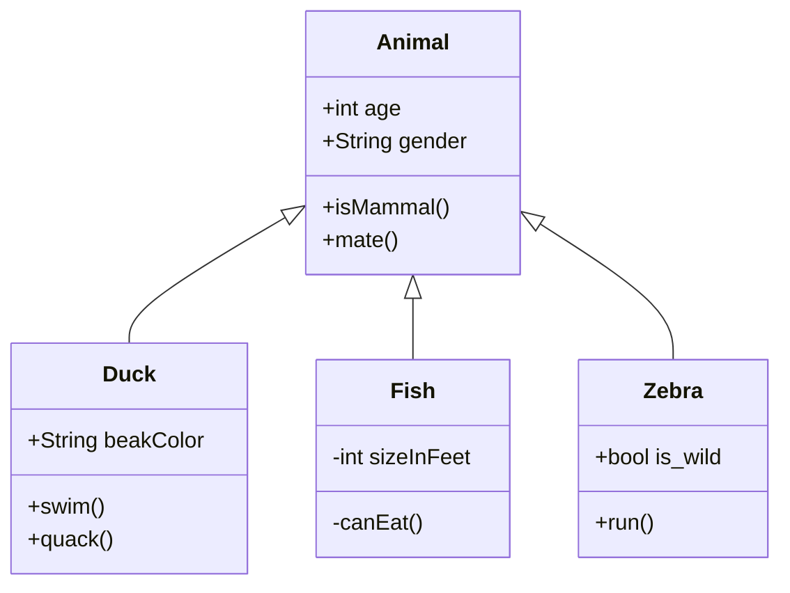

# 4.8 Wie wir ein- und ausatmen

>[!abstract] Hefteintrag
>✏️ [Zu allen Einträgen](https://ammerseegymnasium-my.sharepoint.com/:f:/g/personal/nicolai_emig_ammersee-gymnasium_de/EkmDdXuowQ1AuivFC1VV0pwBZbg_NtxRhU9aBmH8h6QjMg?e=JKDPXO)

> [!todo] Hausaufgabe
> 1. Versuche Folgendes in einem ruhigen Zimmer
> 2. Augen schließen, ruhig auf den Körper konzentrieren und langsam ein- und wieder ausatmen ... ein- und wieder ausatmen. Beschreibe die Veränderungen in deinem Körper beim Ein- und Ausatmen. (mündlich, in Gedanken)
> 3. Lies Seite 76 im Buch
> 4. Fertige den Hefteintrag an (siehe Abschnitt Hefteintrag)

>[!question] Aufgaben
> 📚 1. Buch Seite 77
>  [🚂 Gestufte Lernhilfe für die Gehirnknacker Aufgabe](https://lernplattform.mebis.bayern.de/mod/hvp/view.php?id=37888616)

>[!summary] Arbeitsblätter
>📎 [Zu allen Arbeitsblättern](https://ammerseegymnasium-my.sharepoint.com/:f:/g/personal/nicolai_emig_ammersee-gymnasium_de/Eg3BoRMoe4VGjPIKUXvTvVQBtIgVcgq1nenht0i7DZu19g?e=dpceQM)
> 🖇️ [Zu allen Lösungen für die Arbeitsblätter](https://ammerseegymnasium-my.sharepoint.com/:f:/g/personal/nicolai_emig_ammersee-gymnasium_de/EhCzAYMPXIlOuwt6QjaWdAMBTebWPu95AQi92lRF4R81xQ?e=jmXvCJ)

>[!warning] Apps
> 📱[Atmung - Reihenfolge](https://learningapps.org/view23357133)

>[!danger] Filme
> 🎥 [Das Atmen beim Menschen](https://www.youtube.com/watch?v=roaws9aFwNE)

